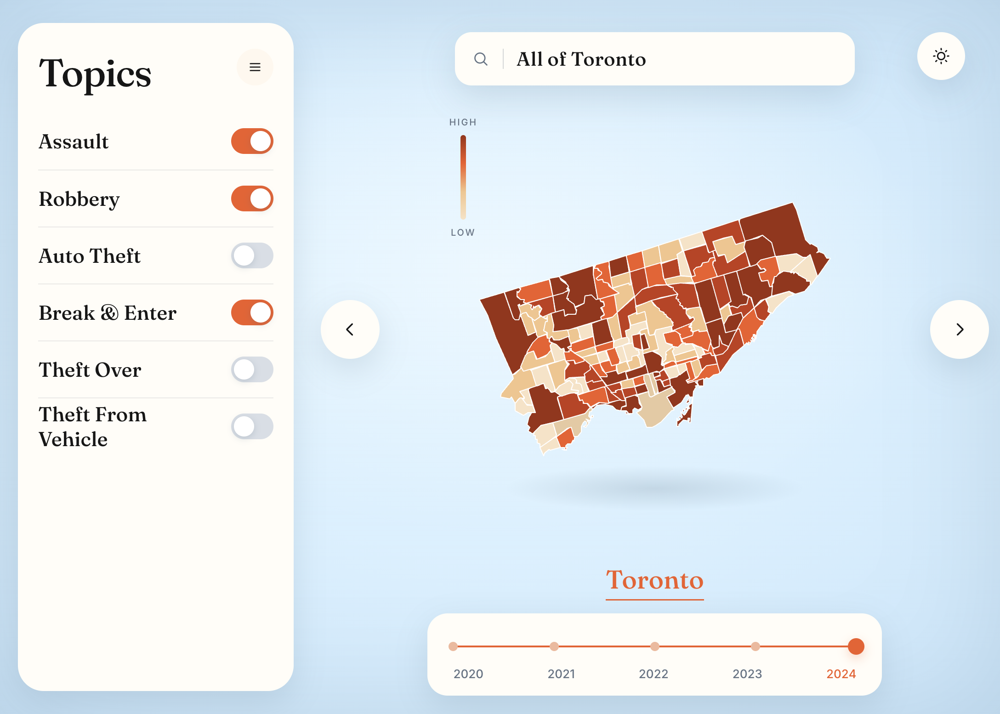
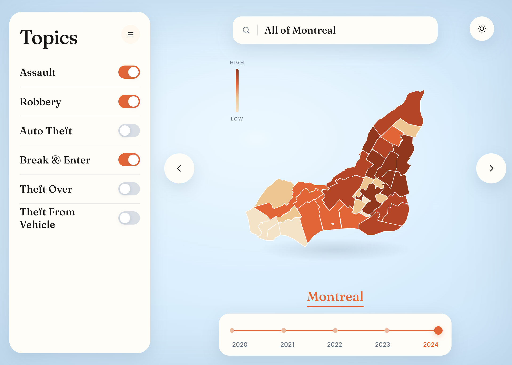
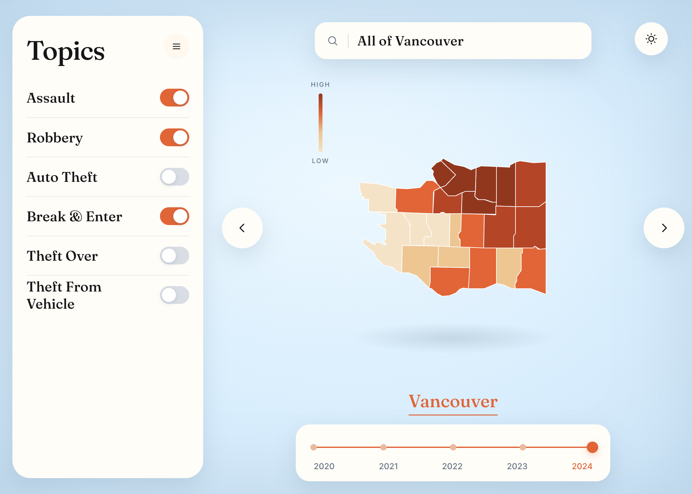
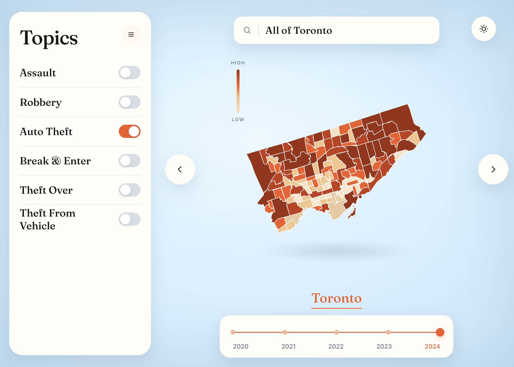
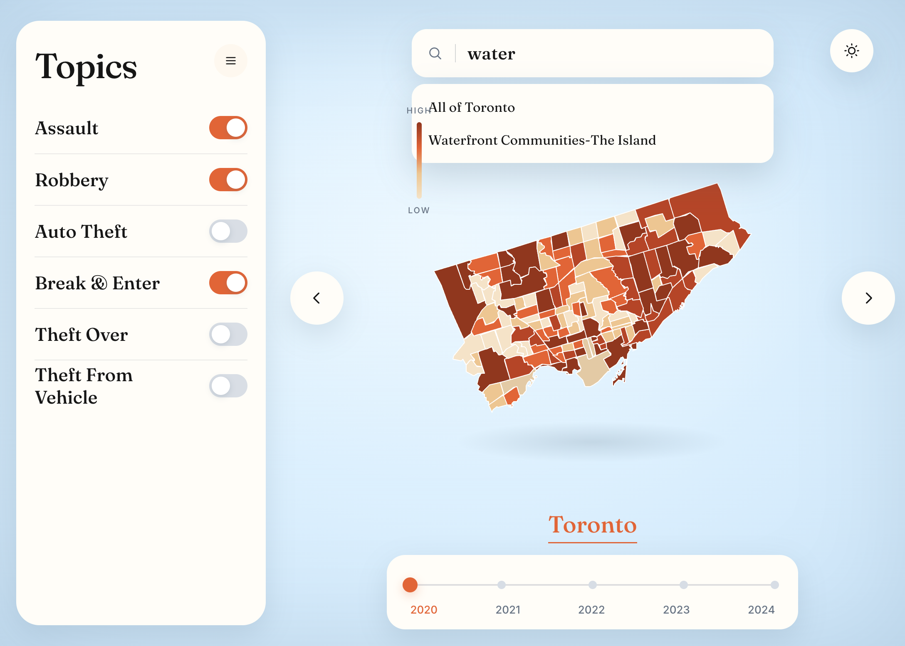
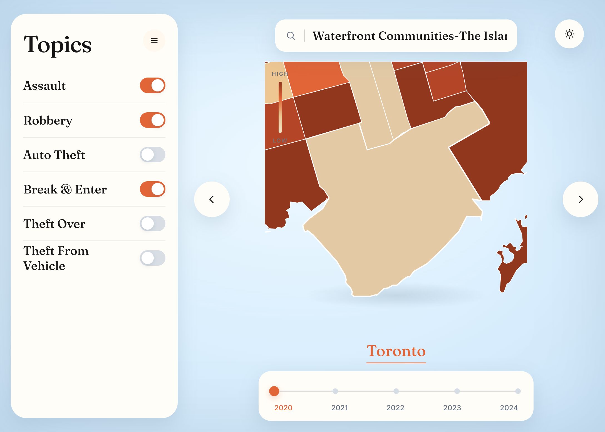
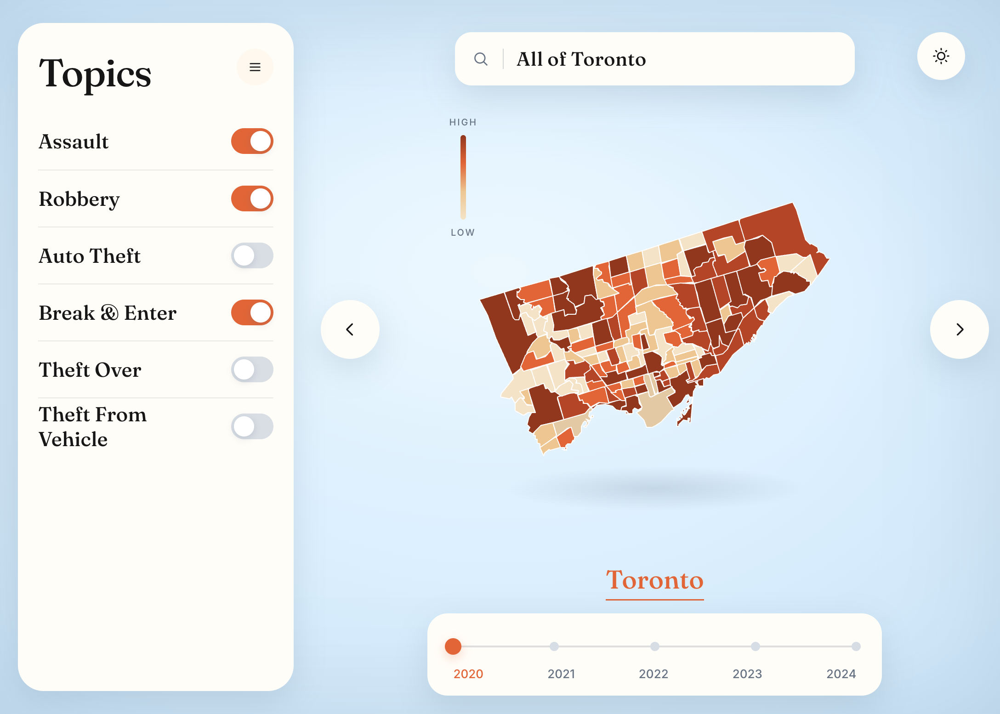
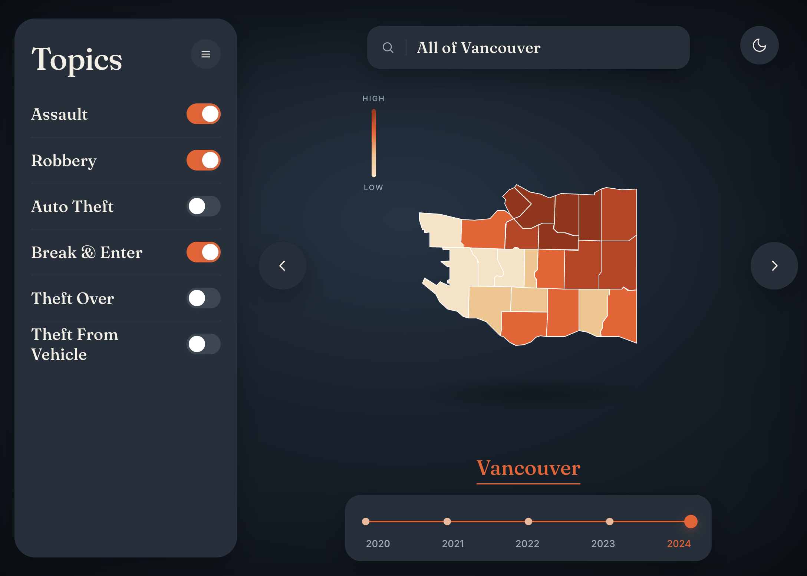
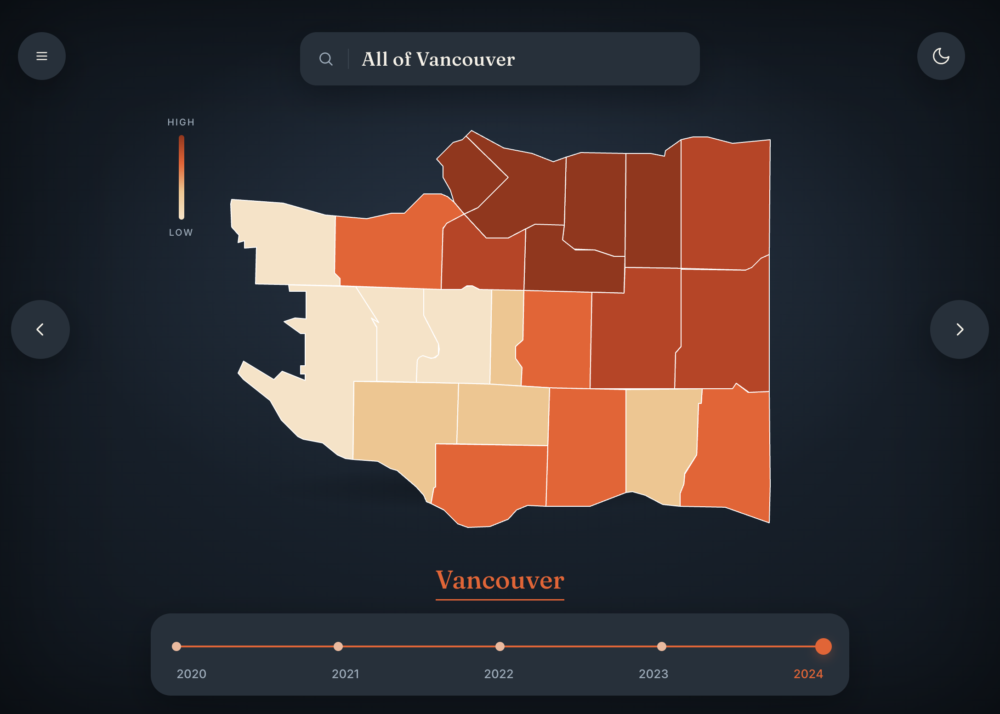

# City Atlas

A learning project: a small digital atlas of **Toronto**, **Montreal**, and **Vancouver**. I built it to practice three things at once — **web mapping**, **UI design**, and **databases with Supabase**.

The map is a choropleth. Each neighbourhood is coloured by official crime counts for the topics you turn on and the year you pick (2020–2024).



## What I’m learning

### Mapping

The shapes come from city GeoJSON. Leaflet and react-leaflet draw them. There is no street basemap on purpose — the neighbourhood polygons *are* the map.

What I practiced here:

- Loading GeoJSON and fitting the camera to a city
- Colouring polygons from numeric data (a choropleth + High / Low legend)
- Joining map names to database rows when the labels do not match
- Zooming to a searched neighbourhood
- Switching cities without rebuilding the whole app

Toronto has many small neighbourhoods. Montreal is drawn as boroughs. Vancouver uses the VPD neighbourhoods.





Topic toggles change which numbers are added together, so the same city can tell a different story. Auto theft, for example, is more suburban than assault and robbery.



Search finds a place by name and flies the map there.





The year rail is the same idea over time. 2020 and 2024 use the same map, different rows from the database.



**Tools:** [Vite](https://vite.dev/), [React](https://react.dev/), [Leaflet](https://leafletjs.com/), [react-leaflet](https://react-leaflet.js.org/), city GeoJSON.

### UI design

I wanted this to feel like an editorial atlas, not an admin dashboard. Powder-blue canvas, ivory controls, one orange accent, and a serif city name.

Things I kept iterating on:

- A **Topics** sidebar with big, obvious toggles
- Collapsing that sidebar so the map can take the full stage
- Light and dark themes
- A year timeline instead of a dropdown
- City arrows instead of a dense nav
- Putting the scale on the map, not in a card stack





### Databases with Supabase

Counts live in Postgres on [Supabase](https://supabase.com/). The browser asks for neighbourhoods and nested yearly stats, then joins those rows onto the GeoJSON.

```
cities
  └── neighbourhoods
        └── crime_stats_indicator  (one row per place × year)
```

What I practiced:

- Tables, foreign keys, and a unique `(hood_id, Year)` so one place can have five years
- Reading with the Supabase JS client (no service-role key in the frontend)
- Row Level Security that allows public **SELECT** only
- Cleaning official open data (Toronto Police, SPVM, Vancouver Police) before insert
- Matching messy place names to map polygons

The app only needs a publishable/anon key. Copy `.env.example` to `.env` and add your project URL and key.

```
VITE_SUPABASE_URL=https://your-project.supabase.co
VITE_SUPABASE_ANON_KEY=your-publishable-or-anon-key
```

## Run it locally

```bash
npm install
cp .env.example .env   # then add your Supabase values
npm run dev
```

Open [http://localhost:5173/](http://localhost:5173/).

## Data notes

| City | Geography | Crime years | Source |
| --- | --- | --- | --- |
| Toronto | Neighbourhoods | 2020–2024 | Toronto Police Service Neighbourhood Crime Rates |
| Montreal | Arrondissements | 2020–2024 | SPVM open data (actes + bilan) |
| Vancouver | Neighbourhoods | 2020–2024 | Vancouver Police year-end neighbourhood reports |

Topics in the UI: Assault, Robbery, Auto Theft, Break & Enter, Theft Over, Theft From Vehicle.

This is a personal learning atlas, not an official crime product. Counts are as published by each city and then joined to the map as carefully as I could.

## Stack

- **Frontend:** React 19, Vite
- **Maps:** Leaflet, react-leaflet, GeoJSON
- **Data:** Supabase (Postgres + JS client)
- **UI:** custom CSS (light / dark), no component library
